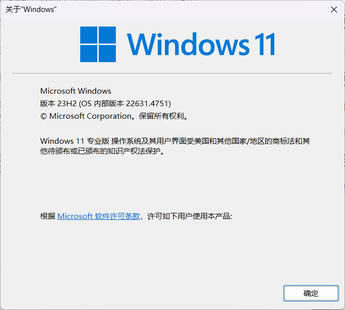
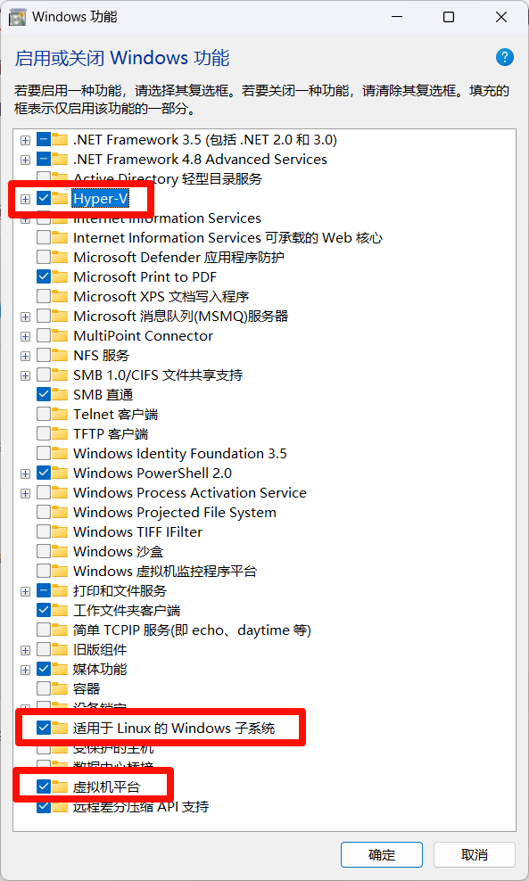
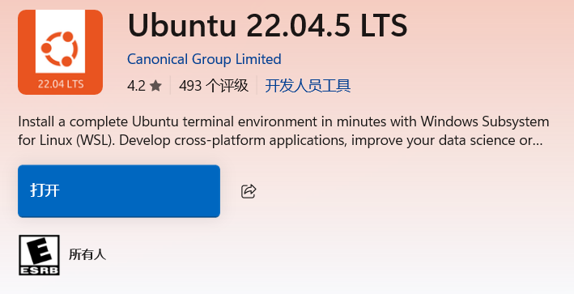
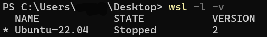
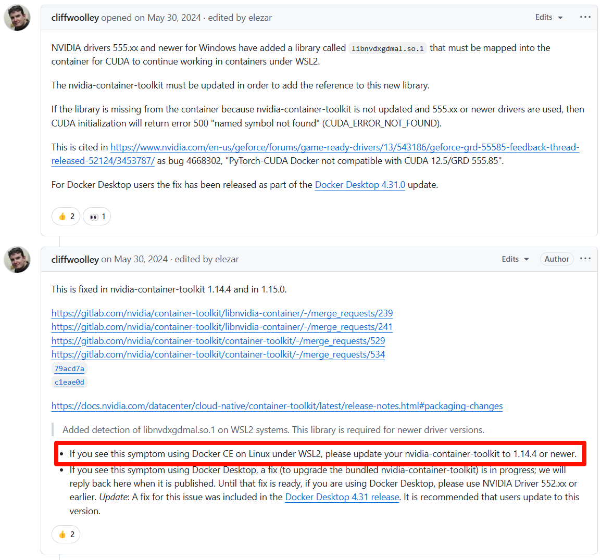
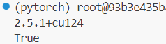

# 实验任务一：环境配置

## 1. 使用机房的电脑配置

详见课程实验指南

## 2. 使用个人电脑配置（Windows11 + WSL 2 + Ubuntu 22.04.5）

**用自己电脑配的好处就是方便，但是麻烦的点在于可能会有意想不到的报错。**

不推荐使用 Vmware 装 Ubuntu 虚拟机配 Docker 和 PyTorch

### 2.1 启动 WSL 功能并安装

1. **检查 WSL 的要求：`win + r` 输入`winver`查看版本，版本需要大于 1903**

   
   
   
   
2. **在设置中搜索并打开“启用或关闭 Windows 功能”，勾选图示的 3 个选项，重启系统**

   


### 2.2 安装 Ubuntu 发行版

1. **使用命令行PowerShell查看是否启用了 Linux 子系统：**

   ```
   wsl -l #如果提示 wsl 不是内部或外部命令，说明你没有启用 Windows 的 Linux 子系统，回到第二步
   ```

2. **升级为最新版本的 WSL**

   ```
   wsl --update
   ```

3. **将安装的所有 Linux 发行版都默认 WSL2 执行**

   ```
   wsl --set-default-version 2
   # wsl --set-version Ubuntu-22.04 2：将 Ubuntu 22.04 发行版设置为使用 WSL 2
   ```

4. **打开 Microsoft Store，并选择想要安装的 Linux 分发版，这里使用和机房电脑相同的系统 Ubuntu 22.04.5 LTS**

   


5. **下载完后点击打开，会打开一个命令行提示正在初始化，之后在那个界面配置 Ubuntu 用户名和密码**

   > 可能出现的问题：下载完成之后，初次打开时报错：
   >
   > ```
   > Installing, this may take a few minutes…
   > WslRegisterDistribution failed with error: 0x800701bc
   > Error: 0x800701bc WSL 2 ??? https://aka.ms/wsl2kernel
   > Press any key to continue…
   > ```
   >
   > 去官网下载wsl2下载 Linux 内核更新包：https://wslstorestorage.blob.core.windows.net/wslblob/wsl_update_x64.msi，并安装。

6. **现在即可进入子系统：**

   ```
   # 直接进入默认子系统
   wsl
   # 指定子系统，并且指定用户为 root
   wsl -d Ubuntu-22.04 -u root
   
   # 关闭所有子系统
   wsl --shutdown 
   # 关闭指定子系统
   wsl -t Ubuntu-22.04
   
   # 卸载指定子系统
   wsl --unregister Ubuntu-22.04
   
   # 列出当前系统存在那些子系统
   wsl -l -v
   
   # 查看正在运行的子系统
   wsl --list --running
   ```

7. **设置进入 Ubuntu 的默认用户为当时安装时填的用户（将 user 替换为你设置的用户名）**

   ```
   ubuntu2204.exe config --default-user user
   ```

8. **迁移 Ubuntu 到别的盘**

    先建好要导入的目录，例如 `d:/wsl2-data/ubuntu-22.04` 

    - 查看当前系统存在那些子系统

      ```
      wsl -l -v
      ```

      

    

    - 停止正在运行的子系统

      ```
      wsl --shutdown
      # wsl -t Ubuntu-22.04
      ```

    - 导出分发版为 tar 文件到 F 盘上并注销，需要等待一段时间，并且当前 Ubuntu 会退出

      ```
      wsl --export Ubuntu-22.04 d://wsl2-data//ubuntu-22.04.tar
      ```

    - 导出完成之后，将原有的Linux卸载

      ```
      wsl --unregister Ubuntu-22.04
      ```

    - 重新导入并安装 WSL 在 D 盘

      ```
      wsl --import Ubuntu-22.04 d://wsl2-data//ubuntu-22.04 d://wsl2-data//ubuntu-22.04.tar --version 2
      ```

    - 设置默认用户为之前安装时的用户，不然默认是 root 身份，使用不方便（将 user 替换为你设置的用户名）

      ```
      ubuntu2204.exe config --default-user user
      ```

9. **之后用 VS Code 连接子系统并打开，按照课程实验任务一，从安装 Docker 继续环境配置**

### 2.3 Docker容器内配置 Conda 和 PyTorch 中可能出现的报错

在**安装 pytorch 及实验所需依赖和验证 PyTorch**这一步

- 输入：

  ```
  python -c "import torch; print(torch.__version__); print(torch.cuda.is_available())"
  ```

- 可能出现报错：

  ```
  2.5.1+cu124
  /root/miniconda3/envs/pytorch/lib/python3.10/site-packages/torch/cuda/__init__.py:129: UserWarning: CUDA initialization: Unexpected error from cudaGetDeviceCount(). Did you run some cuda functions before calling NumCudaDevices() that might have already set an error? Error 500: named symbol not found (Triggered internally at ../c10/cuda/CUDAFunctions.cpp:108.)
    return torch._C._cuda_getDeviceCount() > 0
  False
  ```

在网上找到具体的 issue 和解决方案如图：https://github.com/NVIDIA/nvidia-container-toolkit/issues/520



翻译成中文就是，**在子系统中（注意不是 Docker）将 nvidia-container-toolkit 升级到 1.44.4 或更新的版本**

1. **验证当前版本**

   ```
   apt list --installed | grep nvidia-container-toolkit
   ```

   若当前版本低于 1.14.4，需执行更新。

2. **更新仓库配置**

   ```
   # 清理旧仓库配置
   sudo rm /etc/apt/sources.list.d/nvidia-container-toolkit.list
   
   # 添加新仓库（中科大镜像）
   curl -fsSL https://mirrors.ustc.edu.cn/libnvidia-container/gpgkey | sudo gpg --dearmor -o /usr/share/keyrings/nvidia-container-toolkit-keyring.gpg \
   && curl -s -L https://mirrors.ustc.edu.cn/libnvidia-container/stable/deb/nvidia-container-toolkit.list | \
   sed 's#deb https://nvidia.github.io#deb [signed-by=/usr/share/keyrings/nvidia-container-toolkit-keyring.gpg] https://mirrors.ustc.edu.cn#g' | \
   sudo tee /etc/apt/sources.list.d/nvidia-container-toolkit.list
   ```

3. **更新软件包列表**

   ```
   sudo apt update
   ```

4. **安装/更新至目标版本**

   ```
   # 安装最新版（自动匹配仓库最高版本）
   sudo apt install nvidia-container-toolkit
   
   # 或指定版本（若仓库包含）
   sudo apt install nvidia-container-toolkit=1.14.4-1
   ```

5. **验证更新**

   ```
   nvidia-container-toolkit --version
   ```

   若输出类似 v1.14.4 或更高，则更新成功。

6. **重启子系统和 Docker，再次在 Docker 中尝试 `python -c "import torch; print(torch.__version__); print(torch.cuda.is_available())"`**

   

   说明成功验证


# 实验任务二：PyTorch练习

补全代码：

```python
import numpy as np
import torch
from torch import nn
from torch.utils import data

def synthetic_data(w, b, num_examples):
    """生成 y = Xw + b + 噪声。"""
    X = torch.normal(0, 1, (num_examples, len(w)))
    y = torch.matmul(X, w) + b
    y += torch.normal(0, 0.01, y.shape)
    return X, y.reshape((-1, 1))

true_w = torch.tensor([2, -3.4])
true_b = 4.2
features, labels = synthetic_data(true_w, true_b, 1000)

def load_array(data_arrays, batch_size, is_train=True):
    """构造一个PyTorch数据迭代器。"""
    dataset = data.TensorDataset(*data_arrays)
    return data.DataLoader(dataset, batch_size, shuffle=is_train)

batch_size = 10
data_iter = load_array((features, labels), batch_size)

net = nn.Sequential(nn.Linear(2, 1)) # 线性层
net[0].weight.data.normal_(0, 0.01) # 初始化权重
net[0].bias.data.fill_(0) # 初始化偏置
loss = nn.MSELoss() # 均方误差损失
trainer = torch.optim.SGD(net.parameters(), lr=0.03) # 随机梯度下降优化器

num_epochs = 3
for epoch in range(num_epochs):
    for X, y in data_iter:
        # 计算损失
        l = loss(net(X), y)

        # 清空梯度
        trainer.zero_grad()

        # 反向传播
        l.backward()

        # 优化器更新参数
        trainer.step()

    # 打印训练过程中的损失
    l = loss(net(features), labels)
    print(f'epoch {epoch + 1}, loss {l:f}')
```
