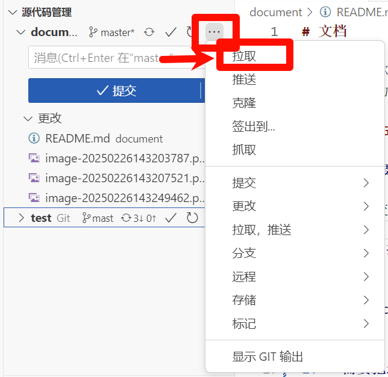
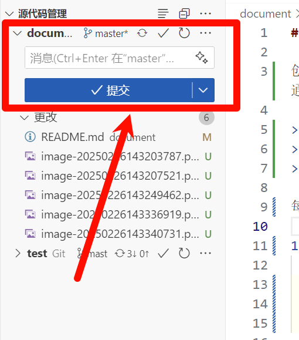

# 1. 迭代一任务说明

## 阅读，标注开源软件，完成开源项目分析文档

项目介绍：Ragas 是一个用于评估大模型应用的开源项目，特色是评估 RAG 系统，也支持评估大模型 Agent，或者用于评估简单的大模型任务。Ragas 库中内置了各种的评估指标，比如上下文精准度、上下文召回率、可信度、回答相关性、回答正确性等等。这些指标按照计算过程中是否使用大模型可以分为大模型驱动的指标和非大模型驱动的指标；按照评估场景可以分为 RAG 指标、Agent 指标、自然语言比对指标、自然语言转 SQL 任务指标、通用指标等等。

仓库链接：https://github.com/explodinggradients/ragas

文档地址：https://docs.ragas.io/en/stable/

基本信息： Python 项目 10957 行代码

**要求**：阅读 Ragas 源码以及官方文档，完成开源项目分析文档：

1. 开源项目分析文档参考：2025软工三-开源项目分析文档示例-开源软件泛读、标注和维护报告文档
2. 不要求和参考文档内容完全一致，但至少包括：功能描述、开源软件的软件架构及各个包和类的作用、软件功能与类间的对应关系、阅读收获
3. 文档以可读性、有用性、可度量为基本前提

## 复现指标，完成评估实验

**数据集介绍**
`translation.csv`：某个大模型针对中译英任务获得的结果，其中 `source_text` 是中文原文，`ground_truth` 是人工提供的高质量参考翻译，`llm_rsp` 是大模型的翻译结果。

`news_summary.csv`：某个大模型针对新闻总结任务获得的结果，其中 `news_content` 是新闻原文，`summary` 是大模型对新闻的总结，`label` 是新闻的标签。

**要求**：针对课程提供的两个数据集，自己实现若干指标（不是直接调 Ragas 库，至少实现一种大模型驱动的指标）对其进行评估，提交代码与评估报告，评估报告内容包括但不限于：指标选取原因，指标实现过程，评估结果分析；


# 2. 关于 Git 配置和 SSH 配置

## Git 配置

每位同学全程使用一致的 Git 用户名、Git 邮箱，要求 Git 用户名为**自己姓名的拼音**，Git邮箱为**校内邮箱**

1. **设置用户名**：将引号里的username替换为自己的姓名拼音

   ```
   git config --global user.name "username"
   ```

2. **设置邮箱（没有双引号）**：将useremail@qq.com替换为校内邮箱，如221900xxx@smail.nju.edu.cn

   ```
   git config --global user.email useremail@qq.com 
   ```

3. **查看用户名和密码**

   ```
   git config user.name
   git config user.email
   ```

4. 查看其他配置信息（git设置列表）

   ```
   git config --list
   ```

## SSH 配置

1. 使用 SSH 签名（推荐 GitLab SSH 签名）步骤：

  - 生成 SSH 密钥对（如果没有的话）：

  - 打开 Git Bash，使用以下命令生成一个新的 SSH 密钥对：

    ```
    ssh-keygen -t rsa -b 4096 -C "你的邮箱" -f ~/.ssh/id_rsa
    ```

  - 这会生成一个新的 SSH 密钥对，默认保存在 ~/.ssh/id_rsa 和 ~/.ssh/id_rsa.pub 文件中。（**大概在C:\Users\你的用户名\.ssh文件夹**）

2. 将 SSH 公钥添加到 GitLab：

   - 登录到 GitLab，进入 用户设置 > SSH 密钥，然后将 ~/.ssh/id_rsa.pub 文件的内容复制到 GitLab 上。

   - 在 Git 中配置使用 SSH 密钥：配置 Git 使用 SSH 签名：

     ```
     git config --global commit.gpgSign true
     ```

   - 然后使用以下命令确保 Git 在提交时使用 SSH 密钥签名：

     ```
     git config --global user.signingkey ~/.ssh/id_rsa
     ```

   - 检查 Git 配置：使用以下命令检查配置是否成功：

     ```
     git config --list
     ```

   - 确保 user.signingkey 被正确设置。

3. 提交时进行签名：使用 git commit 时，Git 会自动使用 SSH 密钥对提交进行签名。

   - 如果报错：尝试：

     ```
     git config --global gpg.format ssh
     ```

     将 SSH 设置为默认

4. 最后在用户设置中找到 **SSH 密钥**，把文件 `id_rsa.pub` 中的信息输入到 key 输入框中，title可以随便起，见名知意即可。然后点击 `Add Keys` 即可


# 3. 关于文档项目修改和提交

创建一个名称为 文档 的项目，每次迭代均在此创建名称为 迭代[x] 的文件夹，将每个迭代要求的文档，例如会议记录、分工情况、过程重要文档、演示视频（视频要求请关注课程后续通知，一般为链接形式）等放在此目录下

> [!TIP]
>
> 尽量不要在网页上直接更改/提交，因为会没有 ssh 验证

每次需要提交/更改：

1. **首先切换到master分支上**

   ```
   git checkout master
   ```

2. **需要把远程master上的代码pull下来**（每次提交前一定要用这一步拉取最新的代码）

   ```
   git pull origin master
   ```

3. 查看状态

   ```
   git status
   ```

4. **提交变更（强制签名）**

   ```
   # 添加所有文档
   git add .
   
   # 提交到本地（必须签名！）
   git commit -S -m "docs: 更新第2次组会记录及指标分工"
   
   # 或分批次提交
   git add 迭代1/会议记录/
   git commit -S -m "docs: 添加第2次组会纪要"
   git add 迭代1/分工表.md
   git commit -S -m "chore: 更新复现任务截止时间"
   ```

5. 推送

   ```
   git push origin master
   ```


## 推荐使用vscode，可以避免命令行

1. 把项目克隆到本地：

   ```
   git clone ssh://git@...
   ```

2. 在 vscode 中打开项目

3. **拉取（每次更改项目前都要拉取一下）**

   

4. 提交：在 “消息”处输入你想备注的话（比如：创建了.../修改了...尽量清楚），点击提交，确定即可

   

