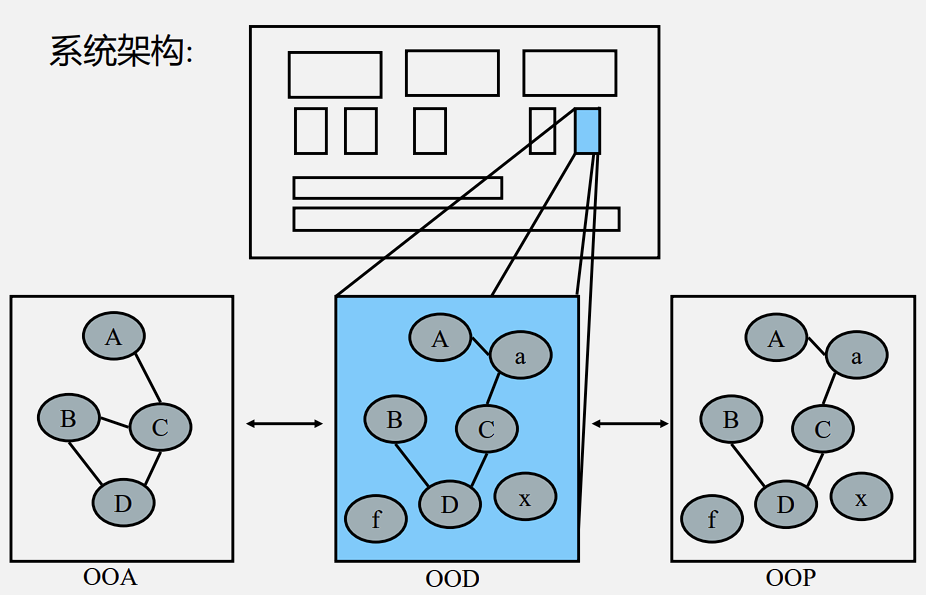

# 1 面向对象设计原则

## 1.1 软件设计基础概念

软件设计要素：

- 需求：系统需要满足的目标
- 规约：系统的外部可观察行为
- 架构：系统一级的主要组成部分、各部分的交互方法、使用的技术
- 设计：如何完成任务、需要写的代码

面向对象软件设计（OOD）定义：

- 将实现的约束条件应用到面向对象分析（OOA） 所产生的概念模型的过程

- 用方法和属性来描述用于构成系统的类
- 添加不明显属于领域的类，比如抽象类和接口
- 描述类是如何构成组件的

OOD 所处环节：

OOD 的难点在于将一个系统分解成对象，如何发现合适的对象？

对象分解来源：

- 分析模型
- 实现空间（数据库、文件、用户界面、IPC...）
- 通用化设计类（如策略模式）

经验的重要性：

- 无简单直接的 OOA 到 OOD 方法
- 通过重复实践积累设计经验
- 技术变化快，但设计原则永存

## 1.2 面向对象设计原则概述

软件的可维护性和可复用性：

- 软件的复用或重用拥有众多优点，如可以提高软件的开发效率，提高软件质量，节约开发成本，**恰当的复用还可以改善系统的可维护性**。

- 面向对象设计复用的目标在于**实现支持可维护性的复用**
- **可维护性复用都是以面向对象设计原则为基础的**
- 重构：在不改变软件现有功能的基础上，通过调整程序代码改善软件的质量、性能，使其程序的设计模式和架构更趋合理，提高软件的扩展性和维护性

## 1.3 七大面向对象设计原则

| 原则名称               | 核心定义                            | 关键要点                                     |
| ---------------------- | ----------------------------------- | -------------------------------------------- |
| 1. 单一职责原则（SRP） | 类应仅有一个引起变化的原因          | 数据职责与行为职责分离，高内聚低耦合         |
| 2. 开闭原则（OCP）     | 对扩展开放，对修改关闭              | 通过抽象化和可变性封装实现可扩展性           |
| 3. 里氏代换原则（LSP） | 基类出现的地方子类必能替代          | 保证继承关系的正确性，开闭原则的重要实现基础 |
| 4. 依赖倒转原则（DIP） | 高层/低层模块依赖抽象，细节依赖抽象 | 抽象耦合优于具体耦合，配置化实现             |
| 5. 接口隔离原则（ISP） | 客户端不应依赖不需要的接口          | 按角色划分接口，提供最小化专用接口           |
| 6. 合成复用原则（CRP） | 优先使用组合/聚合而非继承           | 黑箱复用优于白箱复用，保持系统灵活性         |
| 7. 迪米特法则（LoD）   | 最少知识原则，减少实体间直接交互    | 通过"朋友"限定通信范围，控制信息过载         |

### 1.3.1 单一职责原则（SRP）

定义：一个对象应该只包含单一的职责，并且该职责被完整地封装在一个类中

分析：

- 一个类（或者大到模块，小到方法）承担的职责越多，它被复用的可能性越小
- 类的职责主要包括两个方面：数据职责和行为职责，数据职责通过其属性来体现，而行为职责通过其方法来体现
- 单一职责原则是实现**高内聚、低耦合**的指导方针

### 1.3.2 开闭原则（OCP）

定义：一个软件实体应当**对扩展开放，对修改关闭**（实现在不修改源代码的情况下改变这个模块的行为）

分析：

- 软件实体可以指一个软件模块、一个由多个类组成的局部结构或一个独立的类
- **抽象化**是开闭原则的关键
- 对可变性封装原则：要求找到系统的可变因素并将其封装起来

### 1.3.3 里氏代换原则（LSP）

定义：所有引用基类（父类）的地方必须能透明地使用其子类的对象

分析：

- 在软件中如果能够使用基类对象，那么一定能够使用其子类对象（把基类都替换成它的子类，程序将不会产生任何错误和异常）
- 此在程序中尽量使用基类类型来对对象进行定义，而在运行时再确定其子类类型，用子类对象来替换父类对象

### 1.3.4 依赖倒转原则（DIP）

定义：高层模块不应该依赖低层模块，它们都应该依赖抽象。抽象不应该依赖于细节，细节应该依赖于抽象（要针对接口编程，不要针对实现编程）

分析：

- 代码要依赖于抽象的类，而不要依赖于具体的类；要针对接口或抽象类编程，而不是针对具体类编程。
- **开闭原则是面向对象设计的目标，依赖倒转原则是面向对象设计的主要手段**

- 依赖倒转原则的常用实现方式之一是**在代码中使用抽象类，而将具体类放在配置文件中**

- 类之间的耦合：**零耦合关系、具体耦合关系、抽象耦合关系**

  依赖倒转原则要求客户端依赖于抽象耦合，**以抽象方式耦合是依赖倒转原则的关键**

### 1.3.5 接口隔离原则（ISP）

定义：客户端不应该依赖那些它不需要的接口

分析：

- 使用多个专门的接口，而不使用单一的总接口
  -  一个接口就只代表一个角色
  - 接口仅仅提供客户端需要的行为
- 使用接口隔离原则拆分接口时，首先必须满足单一职责原则，将一组相关的操作定义在一个接口中，且在满足高内聚的前提下，接口中的方法越少越好
- 在进行系统设计时采用**定制服务**的方式，即**为不同的客户端提供宽窄不同的接口**

### 1.3.6 合成复用原则（CRP）

定义：尽量使用对象组合，而不是继承来达到复用的目的

分析：

- 在一个新的对象里通过关联关系（包括组合关系和聚合关系）来使用一些已有的对象，使之成为新对象的一部分；新对象通过委派调用已有对象的方法达到复用其已有功能的目的。

  **要尽量使用组合/聚合关系，少用继承**

- 在面向对象设计中，可以通过两种基本方法在不同的环境中复用已有的设计和实现：

  - **继承复用**：实现简单，易于扩展。破坏系统的封装性；从基类继承而来的实现是静态的，不可能在运行时发生改变，没有足够的灵活性；只能在有限的环境中使用。（“白箱”复用 ）
  - **组合/聚合复用**：耦合度相对较低，选择性地调用成员对象的操作；可以在运行时动态进行。（“黑箱”复用 ）

  - 组合/聚合可以使系统更加灵活，类与类之间的耦合度降低，一般首选使用组合/聚合来实现复用；其次才考虑继承
  - 在使用继承时，需要严格遵循里氏代换原则，有效使用继承会有助于对问题的理解，降低复杂度，而滥用继承反而会增加系统构建和维护的难度以及系统的复杂度，因此需要慎重使用继承复用。

### 1.3.7 迪米特法则（LoD）

定义：每一个软件单位对其他的单位都只有最少的知识，而且局限于那些与本单位密切相关的软件单位（最少知识原则 LKP）

分析：

- 一个软件实体应当尽可能少的与其他实体发生相互作用
- 在迪米特法则中，对于一个对象，其朋友包括以下几类：
  - 当前对象本身
  - 以参数形式传入到当前对象方法中的对象
  - 当前对象的成员对象
  - 如果当前对象的成员对象是一个集合，那么集合中的元素也都是朋友
  - 当前对象所创建的对象
  - 任何一个对象，如果满足上面的条件之一，就是当前对象的“朋友”，否则就是“陌生人”
- 狭义法则 / 广义法则：
  - 狭义的迪米特法则：
    - 如果两个类之间不必彼此直接通信，那么这两个类就不应当发生直接的相互作用。如果其中的一个类需要调用另一个类的某一个方法的话，可以通过第三者转发这个调用
    - 降低类之间的耦合；造成系统的不同模块之间的通信效率降低
  - 广义的迪米特法则：对对象之间的信息流量、流向以及信息的影响的控制，对信息隐藏的控制
- 用途：**控制信息的过载**
  - 类的划分：创建松耦合的类
  - 类的结构设计：每一个类都应当尽量降低其成员变量和成员函数的访问权限
  - 类的设计：只要有可能，一个类型应当设计成不变类
  - 对其他类的引用：一个对象对其他对象的引用应当降到最低

设计原则关系总结：

- 目标：开闭原则
- 指导：迪米特法则
- 基础：SRP + 可变性封装
- 实现：DIP + CRP + LSP + ISP
